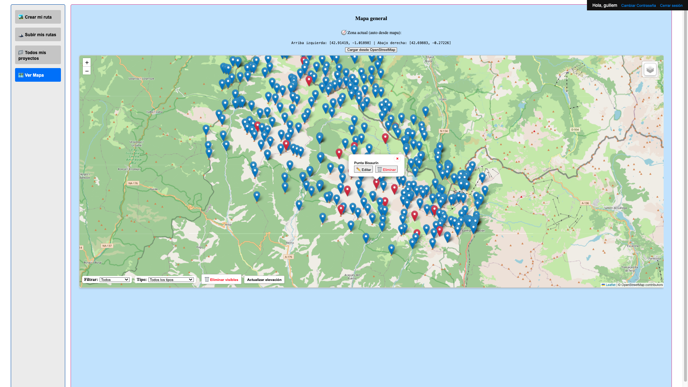

# TravesIA — Public overview

Este repositorio es una **presentación** del proyecto (capturas, resumen y contacto).  
El **código fuente completo** está en un repositorio **privado** y se comparte **bajo solicitud**.

---

## Índice
1. [Qué es](#que-es)
2. [Trabajo Fin de Máster](#tfm)
3. [Tecnologías y arquitectura (alto nivel)](#tecnologias-y-arquitectura-alto-nivel)
4. [Login](#login)
5. [Crear mi ruta](#crear-mi-ruta)
6. [Subir mis rutas](#subir-mis-rutas)
7. [Todos mis proyectos](#todos-mis-proyectos)
8. [Ver mapa](#ver-mapa)
9. [Capturas](#capturas)
10. [Solicitar acceso al código](#solicitar-acceso-al-codigo)
11. [Autor y contacto](#autor-y-contacto)
12. [Aviso](#aviso)

---

<h2 id="que-es">Qué es</h2>

**TravesIA** es un asistente para planificar travesías de montaña.  
Combina mapa interactivo, gestión de tracks y puntos de interés, y un planificador asistido por IA para proponer itinerarios según días, dificultad y preferencias.

[Volver al índice](#indice)

---

<h2 id="tfm">Trabajo Fin de Máster</h2>

Este proyecto se ha desarrollado como **Trabajo Fin de Máster (TFM)** del  
**Máster en Inteligencia Artificial de la Universidad Alfonso X El Sabio**.

El objetivo académico ha sido **diseñar y validar** una herramienta práctica de planificación de travesías que combine **IA** y **datos geoespaciales**, priorizando:
- la generación de propuestas personalizadas a partir de preferencias del usuario,
- la integración de fuentes abiertas,
- y una arquitectura preparada para crecer.

[Volver al índice](#indice)

---

<h2 id="tecnologias-y-arquitectura-alto-nivel">Tecnologías y arquitectura (alto nivel)</h2>

- **Frontend**: aplicación SPA con React, diseño responsive.
- **Backend**: API en Python (framework moderno para APIs REST).
- **Autenticación**: JWT.
- **Mapas / Geo**: librerías de visualización y datos abiertos.
- **Base de datos**: relacional.
- **Integraciones**: proveedor LLM para asistencia en la planificación.

> Se mantiene el detalle a alto nivel para no exponer decisiones internas. La implementación completa reside en un repositorio privado.

[Volver al índice](#indice)

---

<h2 id="login">Login</h2>

**Objetivo:** acceso seguro a las funciones personales (rutas, proyectos, opiniones).

**Qué muestra**
- Formulario con campos **Email o usuario** y **Contraseña**.
- Enlace **“Crear una nueva cuenta”** que abre el formulario de alta.
- Mensajes claros de validación/errores.

**Acciones clave**
- Iniciar sesión y crear sesión segura.
- Crear cuenta nueva desde el enlace de registro.
- Redirección a la pantalla principal con el menú lateral tras autenticar.

**Notas**
- Datos minimizados y protegidos (HTTPS, tokens de corta vida y refresco).
- En este repo público no se exponen endpoints ni credenciales.

**Capturas**

   
  <b>Figura 1.</b> Pantalla de inicio de sesión

   
  <b>Figura 2.</b> Formulario de alta de nueva cuenta

[Volver al índice](#indice)

---

<h2 id="crear-mi-ruta">Crear mi ruta</h2>

**Objetivo:** asistente para definir una travesía con parámetros de usuario.

**Qué muestra**
- Formulario guiado: días, tipo de ruta (lineal/circular), dificultad, pernocta, puntos de paso.
- Vista previa de resultados y estimaciones.

**Acciones clave**
- Generar una propuesta inicial asistida por IA.
- Ajustar parámetros y recalcular.
- Guardar borrador como proyecto.

**Resultados**
- Resumen de la propuesta (distancia, desnivel, puntos clave).
- Exportaciones previstas: GPX (ruta completa / por días), visualización en mapa y (roadmap) PDF.

**Capturas**

   
  <b>Figura 3.</b> Relleno de parámetros y detección en tiempo real (izquierda) con previsualización de puntos en el mapa (derecha)

   
  <b>Figura 4.</b> Confirmación de parámetros y botón <i>Generar propuestas</i>

   
  <b>Figura 5.</b> Propuestas generadas: desglose por días, puntuación y acciones (descargar GPX, ZIP por días, ver en mapa)

[Volver al índice](#indice)

---

<h2 id="subir-mis-rutas">Subir mis rutas</h2>

**Objetivo:** subir y gestionar archivos GPX del usuario.

**Qué muestra**
- Zona de *drag & drop* para **archivos GPX**, con validaciones básicas.
- Campos de **fecha** y **descripción** de la ruta.
- Visualización de la ruta en el mapa con **waypoints detectados**.
- Edición de **tipo/descripción/fotos** de cada waypoint.

**Acciones clave**
- Subir, renombrar y eliminar rutas.
- Editar metadatos y waypoints.
- Guardar ruta procesada.

**Notas**
- Se evita exponer metadatos sensibles en este repo público.
- El procesado del GPX extrae estadísticas básicas y puntos de interés.

**Capturas**

   
  <b>Figura 6.</b> Zona de subida del GPX (drag & drop) con fecha y descripción

   
  <b>Figura 7.</b> Ruta renderizada en mapa; edición de un waypoint (tipo, descripción y fotos)

[Volver al índice](#indice)

---

<h2 id="todos-mis-proyectos">Todos mis proyectos</h2>

**Objetivo:** visualizar y gestionar todas las rutas del usuario en un mapa único.

**Qué muestra**
- Mapa con **todas las rutas subidas** y sus **waypoints**.
- Acciones contextuales sobre cada ruta/waypoint (ver, borrar, editar).

**Acciones clave**
- Clic en una ruta para **centrar y destacar** su trazado.
- Clic en un waypoint para **editar su ficha** (tipo, descripción, fotos).
- Borrar rutas desde el panel de gestión.

**Notas**
- Esta vista facilita una revisión rápida del histórico personal de rutas.

**Capturas**

   
  <b>Figura 8.</b> Mapa con todas las rutas del usuario (waypoints visibles)

   
  <b>Figura 9.</b> Ruta seleccionada con su trazado y marcadores

   
  <b>Figura 10.</b> Edición de un waypoint (tipo, descripción y fotos)

[Volver al índice](#indice)

---

<h2 id="ver-mapa">Ver mapa</h2>

**Objetivo:** explorar el mapa con tracks, waypoints y capas temáticas.

**Qué muestra**
- Mapa general con **puntos de interés importados de OpenStreetMap** (picos, refugios, etc.).
- **Marcadores rojos**: elementos con **opiniones** de usuarios; **azules**: sin opiniones.
- Barra inferior con **filtros** (por tipo/categoría) y acciones rápidas (p. ej., eliminar visibles, actualizar elevación).

**Acciones clave**
- Filtrar por tipo de punto y mostrar/ocultar conjuntos.
- Seleccionar un punto para ver su ficha.
- Editar la **descripción** y **tipo** del waypoint; añadir **opiniones** y **fotos** en pestañas.

**Notas**
- Se emplean datos abiertos y fuentes cartográficas compatibles.
- Roadmap: soporte PWA/offline y caché de teselas.

**Capturas**

   
  <b>Figura 11.</b> Mapa general con puntos de interés (OpenStreetMap). Los marcadores en rojo indican que el punto tiene opiniones.

   
  <b>Figura 12.</b> Ficha de un punto: editor de nombre/tipo/descripción (izquierda) y pestañas de <i>Opiniones</i> / <i>Imágenes</i> (derecha).

[Volver al índice](#indice)

---

<h2 id="capturas">Capturas</h2>

Las capturas usadas están en la carpeta `assets/`.  

[Volver al índice](#indice)

---

<h2 id="solicitar-acceso-al-codigo">Solicitar acceso al código</h2>

El repositorio con el **código** es **privado**.  
Si te interesa revisarlo (recruiters, profesorado o colaboradores), escribe a **gescoi.san@gmail.com** indicando el motivo.  
O bien abre una [issue](../../issues/new?title=Access%20request) titulada **Access request**.

[Volver al índice](#indice)

---

<h2 id="autor-y-contacto">Autor y contacto</h2>

**Guillem Sánchez Escoi**  
Email: **gescoi.san@gmail.com** · GitHub: **guisantes1**

[Volver al índice](#indice)

---

<h2 id="aviso">Aviso</h2>

Este repositorio público contiene material informativo (texto, capturas).  
El **código fuente** no se publica aquí.  
© 2025 Guillem Sánchez Escoi. Todos los derechos reservados.

[Volver al índice](#indice)
